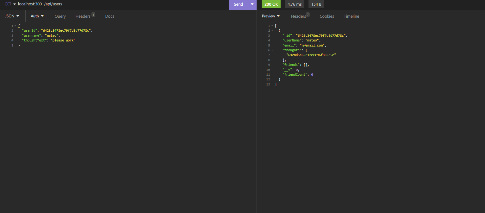

# Social-Network-API 

## Description

this project show the backend of a socail netowrk api

## Table of Contents

- [Installation](#installation)
- [Usage](#usage)
- [License](#license)
- [Contributing](#contributing)
- [Tests](#tests)
- [Questions](#questions)

## Installation

npm i in terminal

## Usage

run npm start in terminal

[walkthrough video](https://drive.google.com/file/d/1FUavMSm5b6-HW_Aab0cu1QnouNf-0hQM/view)

## License

No license

## Contributing

i worked with marcus paccapanicca. his github is https://github.com/mpacct

## Tests

no test

## Questions

Github username: [nickrosales](https://www.github.com/nickrosales)

Email: nickrosales68@gmail.com

  